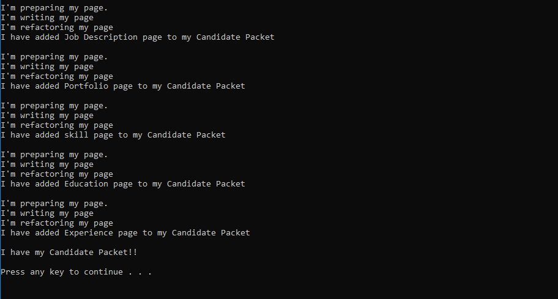

# Design Pattern: Factory Method

## Summary
- This lab is written to represent the art of design pattern using [Factory Method](https://www.exceptionnotfound.net/the-daily-design-pattern-factory-method/)
 using two abstract classes and several derived classes. Layout of abstract and derived classes are as follow:

	- Two abstract classes:
		1. Documents
		2. Pages
		
	- Derived Page classes:
		1. CoverLetter
		2. Education
		3. Experiences
		4. JobDescription
		5. Portfolio
		5. Skills
		6. Summary
		
	- Derived Document classes:
		1. Resume
		2. CandidatePacket
		
Each Document derived classes require list of derived page classes to make it into an object. Visual representation is presented in the 
console. This lab is solely focus on the visual representation of Factory Method in Design Pattern.

## Screen Shot

## How to run the application
- Go to the github repo ( https://github.com/AndrewBaik/Lab-FactoryDesignPattern.git ) 
- Clone the repo to your local computer
- Open up the repo folder using code software such as Atom or Visual Studio 2017
- Start debugger (without debugging)
- Console will open up and run the application.
